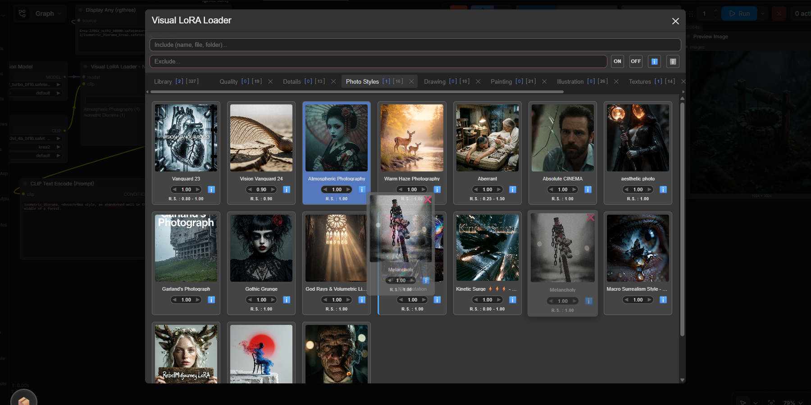
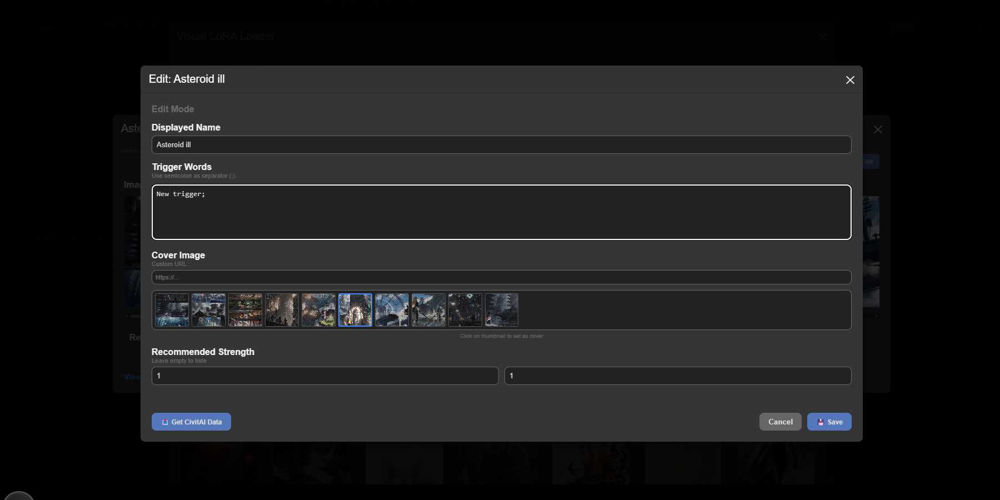

# Neurad Visual LoRA Loader

**A powerful, user-friendly ComfyUI extension for managing, organizing, and loading LoRAs with metadata intelligence.**

Neurad Visual LoRA Loader replaces the standard text-based LoRA selection with a rich, visual interface. It features intelligent caching, tab-based organization, drag-and-drop workflow, and seamless integration with CivitAI to fetch metadata and trigger words automatically.


---

## 🌟 Key Features

### 🎨 Visual Catalog & Grid
*   **Rich Previews:** Browse your LoRAs in a responsive grid with cover images.
*   **Smart Caching:** Images are cached locally and in-memory for instant loading, even with large libraries.
*   **Dynamic Filtering:** Filter by name, file path, folder, or state (Active/Inactive, Has Metadata/No Metadata).
*   **NSFW Auto-Filter:** Intelligent content filtering that hides NSFW-tagged files and folders unless explicitly requested.

### 🗂️ Tab-Based Organization
*   **Custom Tabs:** Create unlimited custom tabs to organize LoRAs by project, style, or character.
*   **Drag & Drop:** Easily move LoRAs between tabs or reorder them within a tab using intuitive drag-and-drop.
*   **Live Counters:** Each tab displays real-time counts of active vs. inactive LoRAs.

### 🧠 Metadata Intelligence
*   **CivitAI Integration:** One-click fetching of metadata (Name,Trigger Words, Exemple Images) directly from CivitAI.
*   **Local Editing:** Override metadata manually. Edit names, set custom cover images, define trigger words, and set strength ranges.
*   **Dual Persistence:** Data is saved in both browser LocalStorage (for speed) and server-side disk storage (for backup and persistence across sessions).

### ⚡ Workflow Integration
*   **Visual Strength Control:** Adjust LoRA strength directly from the card.
*   **Active List Preview:** The node background displays a live list of currently active LoRAs and their strengths.
*   **Hidden Data Widget:** Seamlessly passes JSON data to the ComfyUI backend without cluttering the node interface.

---

## 📸 Screenshots

*(Add your screenshots here in the `images/` folder and reference them below)*

| Visual Grid & Tabs | Metadata Editor |
| :---: | :---: |
|  |  |
| *Browse and organize your library visually.* | *Edit trigger words, strengths, and cover images.* |

---

## 🛠️ Installation

### Prerequisites
*   **ComfyUI** installed and running.
*   **Python 3.10+**

### Method 1: ComfyUI Manager (Recommended)
1.  Open **ComfyUI Manager**.
2.  Click **"Install Custom Nodes"**.
3.  Search for `Visual LoRA Loader`.
4.  Click **Install** and restart ComfyUI.

### Method 2: Manual Installation
1.  Navigate to your ComfyUI `custom_nodes` directory:
    ```bash
    cd ComfyUI/custom_nodes
    ```
2.  Clone this repository:
    ```bash
    git clone https://github.com/DarthNeurad/ComfyUI-Visual-LoRA-Loader.git
    ```
3.  **Restart ComfyUI** completely.

---

## 🚀 Usage Guide

### 1. Opening the Library
*   Add the **Visual LoRA Loader** node to your workflow.
*   Click the **"Open Library"** button on the node.
*   A large floating modal will appear with your full LoRA catalog.

### 2. Managing LoRAs
*   **Activate/Deactivate:** Click anywhere on a card to toggle it On/Off.
*   **Adjust Strength:** Use the `◄` / `►` buttons or click the number to type a specific strength value.
*   **Get Info:** If a card shows a "📥 Get Info" placeholder, click it to fetch metadata from CivitAI.
*   **Edit Details:** Click the **ℹ️** icon on a card to view details. Inside the modal, click **✏️ Edit** to manually change names, trigger words, cover images, or recommended strength.
*   **Image Details:** Inside the modal, click an image to zoom in. Images displaying the **📝** icon include available generation metadata.
*   **Trigger Words:** Inside the modal, you can select multiple trigger words simultaneously; they are automatically copied to the clipboard as a comma-separated list.

### 3. Organizing with Tabs
*   **Create Tab:** Click the **+** button in the tab bar.
*   **Rename:** Double-click a tab name.
*   **Move LoRAs:** Drag a card from the "Library" tab (or any other tab) and drop it onto a custom tab to copy it there.
*   **Reorder:** Drag cards within a tab to reorder them. A blue line indicates where the card will be dropped.

### 4. Filtering Results
*   **Search Field:** Enter any string to include or exclude it. Words are tested individually against LoRA names, filenames, and paths.
*   **Filter Buttons:** Select **On/Off** and/or **Has Meta/No Meta** to further refine your search.
*   **Consistent Results:** Displayed LoRAs will always satisfy all specified criteria simultaneously.
*   **Automatic NSFW Filtering:** "nsfw" is a pre-activated negative keyword. It automatically hides any LoRA with "nsfw" in its name, filename, or path. To display these LoRAs, explicitly include "nsfw" in the positive search field.

### 5. Using in Workflow
*   Once you have selected your LoRAs in the visual interface, close the modal.
*   The node will automatically update its internal hidden widget with the selected LoRAs and strengths.
*   Connect the node to your **Checkpoint Loader** or **LoRA Loader** chain as required by your specific implementation logic.

---

## 💡 Library vs. Node Context

Understanding the separation between **Global Data** and **Node Configuration** is key to mastering this extension:

| Feature | Scope | Behavior |
| :--- | :--- | :--- |
| **LoRA Metadata** | **Global (User)** | Names, trigger words, cover images, and strengths fetched from CivitAI or edited manually are saved **globally**. If you edit a LoRA's name in one workflow, it updates everywhere. |
| **Tabs & Organization** | **Per-Node** | Custom tabs, the order of LoRAs within tabs, and which LoRAs are currently **Active/On** are saved **specific to each node instance**. |
| **Workflow Portability** | **Portable** | When you copy a **Visual LoRA Loader** node from one workflow to another, it brings its own unique tab structure and active selection with it, while still accessing your single, global library of metadata. |

> **Pro Tip:** Create a "Master Library" node with your favorite general-purpose tabs for daily use. Then, create separate nodes for specific projects (e.g., "Portrait Workflow," "Anime Workflow") with their own tailored tab setups. They all share the same underlying metadata intelligence but maintain independent organizations.

---

## ⚙️ Technical Details

### Data Persistence
The extension uses a robust dual-layer storage system:
1.  **Browser LocalStorage:** Used for immediate read/write access during your session.
2.  **Server Disk Backup:** A debounced backup system writes your changes to the server's disk. If you clear your browser cache, the extension will automatically offer to restore your data from the server backup upon the next launch.

### Caching System
*   **Image Cache:** Keeps up to 800 images in memory to prevent flickering and reduce network requests.
*   **Metadata Cache:** Stores fetched CivitAI data locally to avoid hitting API rate limits.

### Clearing Cache
A hidden **"⚠️ Clear Cache"** button is available in the top-left of the modal.
*   **How to access:** Hover over the button for **1 second**. It will turn red and become clickable.
*   **Action:** This wipes both local browser storage and server-side backup files. Use with caution.

---

## 🤝 Contributing

Contributions are welcome! Whether it's fixing a bug, improving the UI, or adding new features:

1.  Fork the repository.
2.  Create your feature branch (`git checkout -b feature/AmazingFeature`).
3.  Commit your changes (`git commit -m 'Add some AmazingFeature'`).
4.  Push to the branch (`git push origin feature/AmazingFeature`).
5.  Open a Pull Request.

---

## 📄 License

This project is licensed under the **MIT License** - see the [LICENSE](LICENSE) file for details.

---

## 🙏 Acknowledgments

*   Built for the **ComfyUI** community.
*   Metadata powered by **CivitAI**.
*   Inspired by the need for better asset management in AI art workflows.

---

**Enjoy organizing your LoRAs!** 🎨🚀